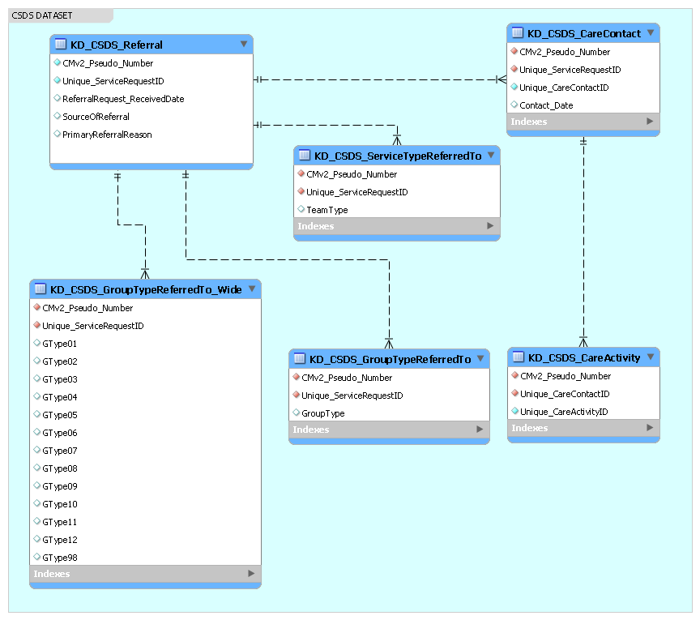
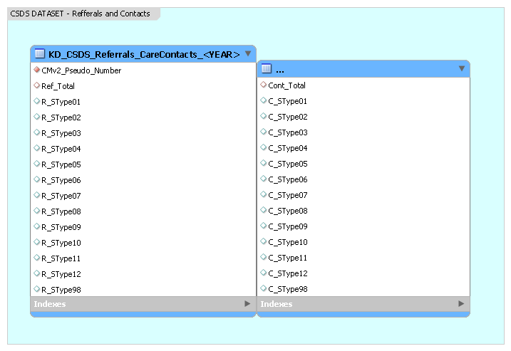
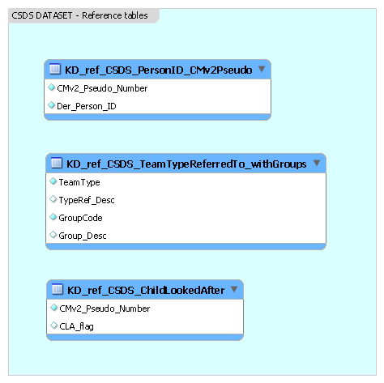

# Data model - Community Services Data Set(CSDS)

Konstantinos Daras 04/10/2022

STATUS: **COMPLETED**

## Schema Design - Clean version

---

## Entities - KD_CSDS_Referral
|Column	|Type	|Description|
|---|---|---|
|CMv2_Pseudo_Number|VARCHAR(100)|Cheshire & Merseyside Pseudo Number|
|Unique_ServiceRequestID|VARCHAR(100)|The unique identifier for a SERVICE REQUEST|
|ReferralRequest_ReceivedDate|VARCHAR(10)|The date the REFERRAL REQUEST was received by the Health Care Provider|
|SourceOfReferral|VARCHAR(5)|The source of a SERVICE REQUEST to a Community Health Service|
|PrimaryReferralReason|VARCHAR(5)|PRIMARY REASON FOR REFERRAL is the primary presenting condition or symptom for which the PATIENT was referred to a Community Health Service|

## Relationships - KD_CSDS_Referral
|Parent table|Primary Key|Rel.|Foreign Key|Child table|
|---|---|---|---|---|
|KD_CSDS_Referral|CMv2_Pseudo_Number, Unique_ServiceRequestID|1:M|KD_CSDS_CareContact|CMv2_Pseudo_Number, Unique_ServiceRequestID|
|KD_CSDS_Referral|CMv2_Pseudo_Number, Unique_ServiceRequestID|1:M|KD_CSDS_ServiceTypeReferredTo|CMv2_Pseudo_Number, Unique_ServiceRequestID|
|KD_CSDS_Referral|CMv2_Pseudo_Number, Unique_ServiceRequestID|1:M|KD_CSDS_GroupTypeRefferedTo|CMv2_Pseudo_Number, Unique_ServiceRequestID|
|KD_CSDS_Referral|CMv2_Pseudo_Number, Unique_ServiceRequestID|1:M|KD_CSDS_GroupTypeRefferedTo_Wide|CMv2_Pseudo_Number, Unique_ServiceRequestID|

---

## Entities - KD_CSDS_CareContact
|Column	|Type	|Description|
|---|---|---|
|CMv2_Pseudo_Number|VARCHAR(100)|Cheshire & Merseyside Pseudo Number|
|Unique_ServiceRequestID|VARCHAR(100)|The unique identifier for a SERVICE REQUEST|
|Unique_CareContactID|VARCHAR(100)|The unique identifier for a CARE CONTACT|
|Contact_Date|VARCHAR(10)|A Care Contact Date is the date on which a CARE CONTACT took place|

## Relationships - KD_CSDS_CareContact
|Parent table|Primary Key|Rel.|Foreign Key|Child table|
|---|---|---|---|---|
|KD_CSDS_CareContact|CMv2_Pseudo_Number, Unique_CareContactID|1:M|KD_CSDS_CareActivity|CMv2_Pseudo_Number, Unique_CareContactID|

---

## Entities - KD_CSDS_CareActivity
|Column	|Type	|Description|
|---|---|---|
|CMv2_Pseudo_Number|VARCHAR(100)|Cheshire & Merseyside Pseudo Number|
|Unique_CareContactID|VARCHAR(100)|The unique identifier for a CARE CONTACT|
|Unique_CareActivityID|VARCHAR(100)|The unique identifier for a CARE ACTIVITY|

---

## Entities - KD_CSDS_ServiceTypeReferredTo
|Column	|Type	|Description|
|---|---|---|
|CMv2_Pseudo_Number|VARCHAR(100)|Cheshire & Merseyside Pseudo Number|
|Unique_ServiceRequestID|VARCHAR(100)|The unique identifier for a SERVICE REQUEST|
|TeamType|VARCHAR(4)|The type of SERVICE or Multidisciplinary Team within a Community Health Service that a PATIENT was referred to - [National Codes](https://www.datadictionary.nhs.uk/data_elements/service_or_team_type_referred_to__community_care_.html)|

---

## Entities - KD_CSDS_GroupTypeReferredTo
|Column	|Type	|Description|
|---|---|---|
|CMv2_Pseudo_Number|VARCHAR(100)|Cheshire & Merseyside Pseudo Number|
|Unique_ServiceRequestID|VARCHAR(100)|The unique identifier for a SERVICE REQUEST|
|GroupType|VARCHAR(4)|Main group of SERVICE type that a PATIENT was referred to - *See KD_CSDS_GroupTypeReferredTo_Wide*|

---

## Entities - KD_CSDS_GroupTypeReferredTo_Wide
|Column	|Type	|Description|
|---|---|---|
|CMv2_Pseudo_Number|VARCHAR(100)|Cheshire & Merseyside Pseudo Number|
|Unique_ServiceRequestID|VARCHAR(100)|The unique identifier for a SERVICE REQUEST|
|GType01|INT|Allied Health Professionals|
|GType02|INT|Audiology|
|GType03|INT|Community rehabilitation|
|GType04|INT|Community services for children, including nursing|
|GType05|INT|Health visitors and midwifery|
|GType06|INT|Medical and dental services|
|GType07|INT|Nursing|
|GType08|INT|Palliative|
|GType09|INT|Podiatry|
|GType10|INT|Single condition community rehabilitation teams|
|GType11|INT|Wheelchair|
|GType12|INT|Other|
|GType98|INT|Unknown/No value|

---

## Schema Design - Referrals and Contacts by PersonID, Service type, and month of year

---

## Entities - KD_CSDS_Referrals_CareContacts_\<YEAR>
|Column	|Type	|Description|
|---|---|---|
|CMv2_Pseudo_Number|VARCHAR(100)|Cheshire & Merseyside Pseudo Number|
|Ref_Total|INT|Total counts of Referrals|
|R_SType01|INT|Allied Health Professionals (Referral counts)|
|R_SType02|INT|Audiology (Referral counts)|
|R_SType03|INT|Community rehabilitation (Referral counts)|
|R_SType04|INT|Community services for children, including nursing (Referral counts)|
|R_SType05|INT|Health visitors and midwifery (Referral counts)|
|R_SType06|INT|Medical and dental services (Referral counts)|
|R_SType07|INT|Nursing (Referral counts)|
|R_SType08|INT|Palliative (Referral counts)|
|R_SType09|INT|Podiatry (Referral counts)|
|R_SType10|INT|Single condition community rehabilitation teams (Referral counts)|
|R_SType11|INT|Wheelchair (Referral counts)|
|R_SType12|INT|Other (Referral counts)|
|R_SType98|INT|Unknown/No value (Referral counts)|
|Cont_Total|INT|Total counts of Care Contacts|
|C_SType01|INT|Allied Health Professionals (Contact counts)|
|C_SType02|INT|Audiology (Contact counts)|
|C_SType03|INT|Community rehabilitation (Contact counts)|
|C_SType04|INT|Community services for children, including nursing (Contact counts)|
|C_SType05|INT|Health visitors and midwifery (Contact counts)|
|C_SType06|INT|Medical and dental services (Contact counts)|
|C_SType07|INT|Nursing (Contact counts)|
|C_SType08|INT|Palliative (Contact counts)|
|C_SType09|INT|Podiatry (Contact counts)|
|C_SType10|INT|Single condition community rehabilitation teams (Contact counts)|
|C_SType11|INT|Wheelchair (Contact counts)|
|C_SType12|INT|Other (Contact counts)|
|C_SType98|INT|Unknown/No value (Contact counts)|
|TStamp| VARCHAR(7)|Timestamp (\<YEAR>-\<MONTH>)

---

## Schema Design - Reference tables

---

## Reference tables - KD_ref_CSDS_PersonID_CMPseudo
|Column	|Type	|Description|
|---|---|---|
|CMv2_Pseudo_Number|VARCHAR(100)|Cheshire & Merseyside Pseudo Number|
|Der_Person_ID|VARCHAR(100)| Person Identifier (cleaned version to remove multiple Person_IDs for the same patient)|

---

## Reference tables - KD_ref_CSDS_TeamTypeReferredTo_withGroups
|Column	|Type	|Description|
|---|---|---|
|TeamType|VARCHAR(4)|The type of SERVICE or Multidisciplinary Team within a Community Health Service that a PATIENT was referred to - [National Codes](https://www.datadictionary.nhs.uk/data_elements/service_or_team_type_referred_to__community_care_.html)|
|TypeRef_Desc|VARCHAR(100)|The name of SERVICE or Multidisciplinary Team within a Community Health Service that a PATIENT was referred to.|
|GroupCode|VARCHAR(4)|The Main group of SERVICE type that a PATIENT was referred to.|
|Group_Desc|VARCHAR(100)|The Name of Main group SERVICE type that a PATIENT was referred to.|

---

## Reference tables - KD_ref_CSDS_ChildLookedAfter
|Column	|Type	|Description|
|---|---|---|
|CMv2_Pseudo_Number|VARCHAR(100)|Cheshire & Merseyside Pseudo Number|
|CLA_flag|INT| An indication of whether a PATIENT is a Looked After Child|

