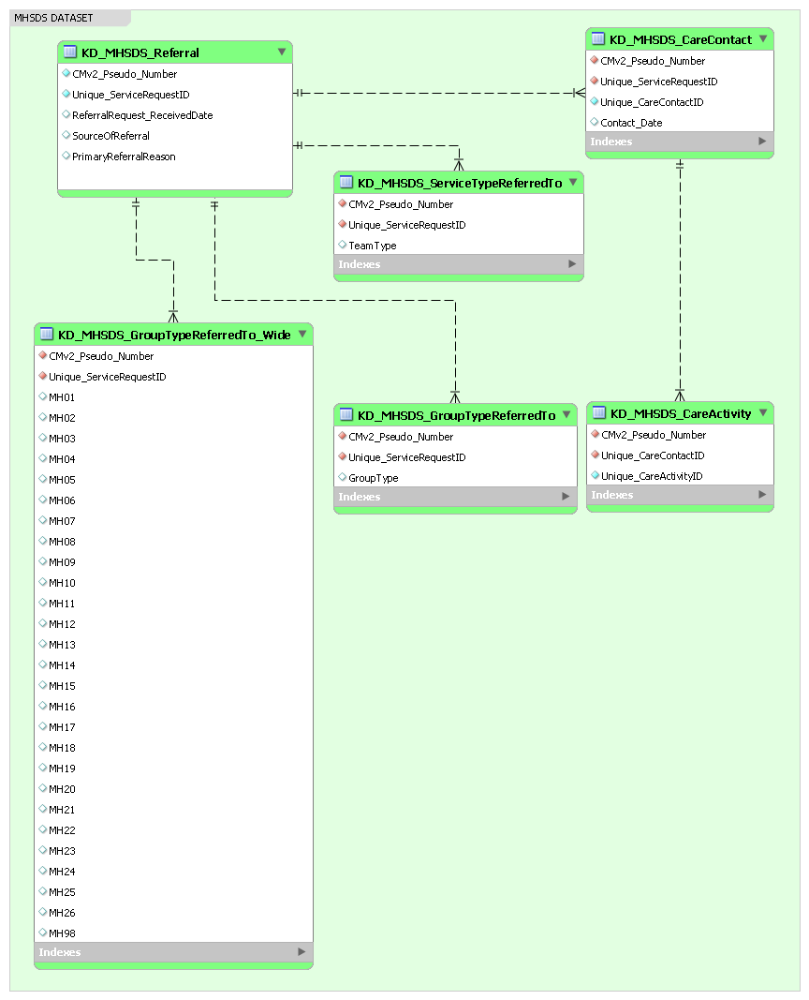
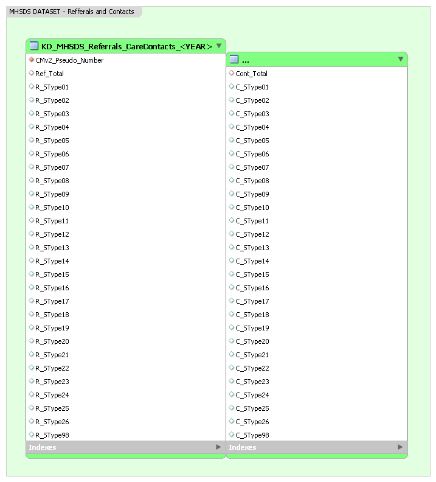
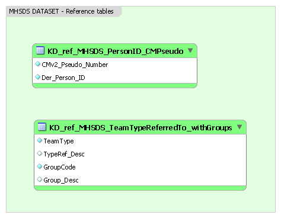

# Data model - Mental Health Services Data Set(MHSDS)

Konstantinos Daras 04/10/2022

STATUS: **COMPLETED**

## Schema Design - Clean/filtered/linked version

---

## Entities - KD_MHSDS_Referral
|Column	|Type	|Description|
|---|---|---|
|CMv2_Pseudo_Number|VARCHAR(100)|Cheshire & Merseyside Pseudo Number|
|Unique_ServiceRequestID|VARCHAR(100)|The unique identifier for a SERVICE REQUEST|
|ReferralRequest_ReceivedDate|VARCHAR(10)|The date the REFERRAL REQUEST was received by the Health Care Provider|
|SourceOfReferral|VARCHAR(5)|The source of a SERVICE REQUEST to a Mental Health Service|
|PrimaryReferralReason|VARCHAR(5)|PRIMARY REASON FOR REFERRAL is the primary presenting condition or symptom for which the PATIENT was referred to a Mental Health Service|

## Relationships - KD_MHSDS_Referral
|Parent table|Primary Key|Rel.|Foreign Key|Child table|
|---|---|---|---|---|
|KD_MHSDS_Referral|CMv2_Pseudo_Number, Unique_ServiceRequestID|1:M|KD_MHSDS_CareContact|CMv2_Pseudo_Number, Unique_ServiceRequestID|
|KD_MHSDS_Referral|CMv2_Pseudo_Number, Unique_ServiceRequestID|1:M|KD_MHSDS_ServiceTypeReferredTo|CMv2_Pseudo_Number, Unique_ServiceRequestID|
|KD_MHSDS_Referral|CMv2_Pseudo_Number, Unique_ServiceRequestID|1:M|KD_MHSDS_GroupTypeRefferedTo|CMv2_Pseudo_Number, Unique_ServiceRequestID|
|KD_MHSDS_Referral|CMv2_Pseudo_Number, Unique_ServiceRequestID|1:M|KD_MHSDS_GroupTypeRefferedTo_Wide|CMv2_Pseudo_Number, Unique_ServiceRequestID|

---

## Entities - KD_MHSDS_CareContact
|Column	|Type	|Description|
|---|---|---|
|CMv2_Pseudo_Number|VARCHAR(100)|Cheshire & Merseyside Pseudo Number|
|Unique_ServiceRequestID|VARCHAR(100)|The unique identifier for a SERVICE REQUEST|
|Unique_CareContactID|VARCHAR(100)|The unique identifier for a CARE CONTACT|
|Contact_Date|VARCHAR(10)|A Care Contact Date is the date on which a CARE CONTACT took place|

## Relationships - KD_MHSDS_CareContact
|Parent table|Primary Key|Rel.|Foreign Key|Child table|
|---|---|---|---|---|
|KD_MHSDS_CareContact|CMv2_Pseudo_Number, Unique_CareContactID|1:M|KD_MHSDS_CareActivity|CMv2_Pseudo_Number, Unique_CareContactID|

---

## Entities - KD_MHSDS_CareActivity
|Column	|Type	|Description|
|---|---|---|
|CMv2_Pseudo_Number|VARCHAR(100)|Cheshire & Merseyside Pseudo Number|
|Unique_CareContactID|VARCHAR(100)|The unique identifier for a CARE CONTACT|
|Unique_CareActivityID|VARCHAR(100)|The unique identifier for a CARE ACTIVITY|

---

## Entities - KD_MHSDS_ServiceTypeReferredTo
|Column	|Type	|Description|
|---|---|---|
|CMv2_Pseudo_Number|VARCHAR(100)|Cheshire & Merseyside Pseudo Number|
|Unique_ServiceRequestID|VARCHAR(100)|The unique identifier for a SERVICE REQUEST|
|TeamType|VARCHAR(4)|The type of SERVICE or Multidisciplinary Team within a Mental Health Service that a PATIENT was referred to - [National Codes](https://www.datadictionary.nhs.uk/data_elements/service_or_team_type_referred_to__mental_health_.html)|

---

## Entities - KD_MHSDS_GroupTypeReferredTo
|Column	|Type	|Description|
|---|---|---|
|CMv2_Pseudo_Number|VARCHAR(100)|Cheshire & Merseyside Pseudo Number|
|Unique_ServiceRequestID|VARCHAR(100)|The unique identifier for a SERVICE REQUEST|
|GroupType|VARCHAR(4)|Main group of SERVICE type that a PATIENT was referred to - *See KD_MHSDS_GroupTypeReferredTo_Wide*|

---

## Entities - KD_MHSDS_GroupTypeReferredTo_Wide
|Column	|Type	|Description|
|---|---|---|
|CMv2_Pseudo_Number|VARCHAR(100)|Cheshire & Merseyside Pseudo Number|
|Unique_ServiceRequestID|VARCHAR(100)|The unique identifier for a SERVICE REQUEST|
|MH01|INT|Asylum|
|MH02|INT|Autism|
|MH03|INT|Community|
|MH04|INT|Community Organic|
|MH05|INT|Crisis|
|MH06|INT|Eating|
|MH07|INT|Education|
|MH08|INT|Gambling|
|MH09|INT|Gen. Psychiatry|
|MH10|INT|Judicial|
|MH11|INT|LAC|
|MH12|INT|Learning Community|
|MH13|INT|Learning Forensic|
|MH14|INT|Liaison|
|MH15|INT|Neurodevelopment|
|MH16|INT|Other|
|MH17|INT|Perinatal Parenting|
|MH18|INT|Personality|
|MH19|INT|Primary Care|
|MH20|INT|Psychological non IAPT|
|MH21|INT|Psychosis Early|
|MH22|INT|Roughsleeping|
|MH23|INT|Severe|
|MH24|INT|SP Access|
|MH25|INT|Substance|
|MH26|INT|Youth Offend|
|MH98|INT|Unknown/No value|

---

## Schema Design - Referrals and Contacts by PersonID, Service type, and month of year

---

## Entities - KD_MHSDS_Referrals_CareContacts_\<YEAR>
|Column	|Type	|Description|
|---|---|---|
|CMv2_Pseudo_Number|VARCHAR(100)|Cheshire & Merseyside Pseudo Number|
|Ref_Total|INT|Total counts of Referrals|
|R_SType01|INT|Asylum|
|R_SType02|INT|Autism|
|R_SType03|INT|Community|
|R_SType04|INT|Community Organic|
|R_SType05|INT|Crisis|
|R_SType06|INT|Eating|
|R_SType07|INT|Education|
|R_SType08|INT|Gambling|
|R_SType09|INT|Gen. Psychiatry|
|R_SType10|INT|Judicial|
|R_SType11|INT|LAC|
|R_SType12|INT|Learning Community|
|R_SType13|INT|Learning Forensic|
|R_SType14|INT|Liaison|
|R_SType15|INT|Neurodevelopment|
|R_SType16|INT|Other|
|R_SType17|INT|Perinatal Parenting|
|R_SType18|INT|Personality|
|R_SType19|INT|Primary Care|
|R_SType20|INT|Psychological non IAPT|
|R_SType21|INT|Psychosis Early|
|R_SType22|INT|Roughsleeping|
|R_SType23|INT|Severe|
|R_SType24|INT|SP Access|
|R_SType25|INT|Substance|
|R_SType26|INT|Youth Offend|
|R_SType98|INT|Unknown/No value|
|Cont_Total|INT|Total counts of Care Contacts|
|C_SType01|INT|Asylum|
|C_SType02|INT|Autism|
|C_SType03|INT|Community|
|C_SType04|INT|Community Organic|
|C_SType05|INT|Crisis|
|C_SType06|INT|Eating|
|C_SType07|INT|Education|
|C_SType08|INT|Gambling|
|C_SType09|INT|Gen. Psychiatry|
|C_SType10|INT|Judicial|
|C_SType11|INT|LAC|
|C_SType12|INT|Learning Community|
|C_SType13|INT|Learning Forensic|
|C_SType14|INT|Liaison|
|C_SType15|INT|Neurodevelopment|
|C_SType16|INT|Other|
|C_SType17|INT|Perinatal Parenting|
|C_SType18|INT|Personality|
|C_SType19|INT|Primary Care|
|C_SType20|INT|Psychological non IAPT|
|C_SType21|INT|Psychosis Early|
|C_SType22|INT|Roughsleeping|
|C_SType23|INT|Severe|
|C_SType24|INT|SP Access|
|C_SType25|INT|Substance|
|C_SType26|INT|Youth Offend|
|C_SType98|INT|Unknown/No value|
|TStamp| VARCHAR(7)|Timestamp (\<YEAR>-\<MONTH>)

---

## Schema Design - Reference tables

---

## Reference tables - KD_ref_MHSDS_PersonID_CMPseudo
|Column	|Type	|Description|
|---|---|---|
|CMv2_Pseudo_Number|VARCHAR(100)|Cheshire & Merseyside Pseudo Number|
|Der_Person_ID|VARCHAR(100)| Person Identifier (cleaned version to remove multiple Person_IDs for the same patient)|

---

## Reference tables - KD_ref_MHSDS_TeamTypeReferredTo_withGroups
|Column	|Type	|Description|
|---|---|---|
|TeamType|VARCHAR(4)|The type of SERVICE or Multidisciplinary Team within a Mental Health Service that a PATIENT was referred to - [National Codes](https://www.datadictionary.nhs.uk/data_elements/service_or_team_type_referred_to__mental_health_.html)|
|TypeRef_Desc|VARCHAR(100)|The name of SERVICE or Multidisciplinary Team within a Mental Health Service that a PATIENT was referred to.|
|GroupCode|VARCHAR(4)|The Main group of SERVICE type that a PATIENT was referred to.|
|Group_Desc|VARCHAR(100)|The Name of Main group SERVICE type that a PATIENT was referred to.|

---

