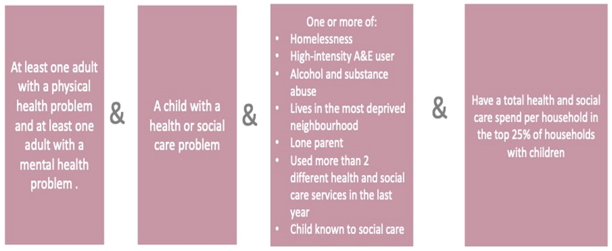

# Complex households
## Authors 
[Dr Roberta Piroddi](https://www.liverpool.ac.uk/population-health/staff/roberta-piroddi/) (rpiroddi@liverpool.ac.uk),

[Dr Konstantinos Daras](https://www.liverpool.ac.uk/population-health/staff/konstantinos-daras/) (konstantinos.daras@liverpool.ac.uk),

[Prof Ben Barr](https://www.liverpool.ac.uk/population-health/staff/benjamin-barr/) (benbarr@liverpool.ac.uk) 

## Description 
This repository contains code, data and documentation to implement the algorithm to identify households with children with the most complex needs in C&M. The code consists of sql and R scripts; the data is in comma separated values, excel. Documentation is in tiff images, power-point slides and pdfs.

The outcome is a binary segmentation of all individuals living in households with children as belonging to the highest complexity category of households or not, for a given period of 12 months (in our example 2021) for a given local authority, based on cumulative annual features of service utilisation and service cost and health and social characteristics in that period of 12 months. 

To identify these households, the algorithm uses several data sources: gp records, secondary (APC- admitted patient care, and ECDS – emergency cere), community health services (CSDS), mental health services (MHSDS), adult social care records (ASC), ONS linked mortality (Mort) records, and a one-off record of pseudonymised residential identifiers linked to individual pseudonyms (PUPRN).

The process consists of three steps: 
1. Different datasets are linked and restructured to be in a format where it is possible to extract the features of interest. This is contained in *\01_restructure_data* 
2. Datasets, restructured and linked datasets are used to extract features, and all features are concatenated into a single table, with one row per person registered with GPs and as many columns as features computed per individual. This is contained in *\02_extract_features*
3. The input table created at the end of step 2 is used as input to step 3, where algorithm identifies the households with most complex needs and segments the population into 2 categories: one of complex households and the rest. This is contained in *\03_find_households*.

## Schematic workflow

## Step 1 (\01_restructure_data)
Not all data sources need to be restructured before extracting features.
GP data is restructured to extract demographic characteristics (MPI table), conditions with conditions start date and the last recorded date (Conditions table) and a segmentation (Segment) table where people are assigned categories of single disease, of multiple diseases (e.g. cardiovascular disease), some social characteristics (e.g. homeless, complex).
The snomed codes used to define the conditions for the Conditions table are in *GP\groupcodes_v2.xlsx*
The Segment table is the one that is used to extract features, by definition in the sql code, the segment table is a snapshot of the presence of a condition at the time period when the feature needs to be calculated for.

MHSDS and CSDS also need to be restructured.

Subfolders \GP – containing steps to restructure GP data, \MHSDS – containing steps to restructure MHSDS data, \CSDS – containing steps to restructure CSDS data, .

All scripts in SQL. Run following numeric order in file name. 

## Step 2 (\02_extract_features)
The process of feature extraction is divided in 2 parts:

1. Features are extracted and yearly summaries calculated for each individual
2. Features are added to a cohort table containing information of every person registered with a GP: the list of these people is from the MPI table (e.g. the number of rows is the number of people in the population), the number of columns accrues with more categories of features being added. The final list of variables is in *“input_complexhouseholds_v2.xlsx”*

 The categories of features are:
- demographic characteristics
- residential characteristics
- social characteristics
- health characteristics (e.g. presence of health conditions/category of health conditions)
- annual antidepressant prescriptions
- annual use and classification of secondary care services
- annual cost of use of secondary services
- annual use and classification of mental health services
- annual use and classification of community health services
- annual use and classification of adult social care services

The output is a cohort table called *RP007_SPHD_7*. This is a sql table with format as in *“input_complexhouseholds_v2.xlsx”*. 
The sql cohort is divided and extracted into **.csv* tables - **_cldat_2021.csv*, one for each local authority to be input for the next step.

All scripts in SQL. Run following numeric order in file name. 

## Step 3 (\03_find_households)
This contain R scripts to compute from the features a household complexity score, assign it to each household, identify which households have children, separate these households into two categories of highest need or not, and assign a binary label to each of these households.
The definition of complex households is:

Script 01_system_complexhouseholds_compile_cohort.R implements the definition above. It takes as input **_cldat_2021.csv* (format shown in in *“input_complexhouseholds_v2.xlsx”*). 
Generate as output the individual level characteristics and a complex household label - **indiv_household_dataset_children.Rdata*, the household level characteristics and a complex household label - **household_dataset_children.Rdata*.
Script *02_ system_complexhouseholds_produce_reports* shows an example of analysis and plots and statistics which would be good to have in a dashboard. It outputs a powerpoint slide deck **complex_households.pptx* with the report and a lot of plots. All in subfolder *\Figures* Script *00_ system_complexhouseholds_run_scripts* iterates through each local authority, since the segmentation and analysis are at a local authority level.

The costs of health and social care activity was approximately estimated applying the unit costs listed in the *"Estimation of costs applied to Complex households model.docx"* document.

Subfolders *\data* – contains auxiliary open source data, and *\figures* – contains report and plots examples.

All scripts in R. Run following numeric order in file name. 

## Acknowledgment
**The authors would like to express their gratitude to Justine Wiltshire (justine.wiltshire@nhs.net) - Analytics Manager in The Strategy Unit of NHS Midlands & Lancashire Commissioning Support Unit for sharing the initial SQL scripts and Arden & GEM for providing the support with the data. Their contribution was invaluable in the development of this work.**

## Funders
**This work was supported by funding of the National Institute for Health and Social Care Research - NIHR - Public Policy Research Programme grant number 202428 - RESTORE: Research for Equitable sySTem respOnse and REcovery.**

**The views expressed in this publication are those of the authors and not necessarily those of the National Institute for Health and Social Care Research or the Department for Health and Social Care.**

